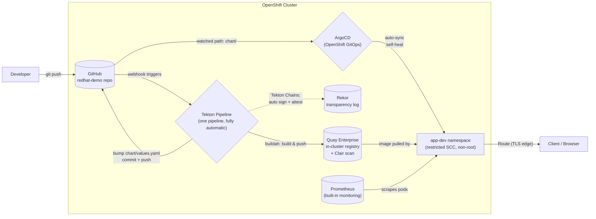

# Nginx Reference Deployment — Architecture

*OpenShift-native CI/CD & GitOps · single environment (dev) · client demo*

**Source:** GitHub (client's existing tool, unchanged) · **CI/CD:** one Tekton pipeline (OpenShift Pipelines) · **Signing:** Tekton Chains + Rekor · **Registry:** Quay Enterprise (in-cluster) · **Delivery:** ArgoCD (OpenShift GitOps) · **Monitoring:** built-in Prometheus/Alertmanager

---

## Flow

## Flow, in words

1. Developer pushes to **GitHub** — the client's existing source of truth, untouched.
2. One **Tekton Pipeline** runs natively on OpenShift (no GitHub Actions runners, no cluster credentials leaving the platform): `git-clone` → `buildah build` → push to the **in-cluster Quay Enterprise** registry, which scans the image with **Clair** as it lands.
3. **Tekton Chains** automatically signs the image and writes an attestation to **Rekor** (the sigstore transparency log) — no manual `cosign` step, no key management.
4. The same pipeline bumps `chart/values.yaml` with the new immutable image tag and pushes the commit back to GitHub — this is the audit trail: every deploy is a `git log` entry.
5. **ArgoCD** watches the `chart/` path and auto-syncs `app-dev`, self-healing any manual drift.
6. **Prometheus** (cluster monitoring, user-workload monitoring already enabled) scrapes pod health/resource metrics for `app-dev` with zero extra setup.

One pipeline, one environment, no manual promotion step — every push to `main` is live, end to end, with nothing hand-triggered in between.

---

## Security controls baked in

| Layer | Control |
|---|---|
| Source | Branch protection on `main`; pipeline only triggers off reviewed commits |
| Build | Non-root UBI9 base image; `buildah` runs unprivileged via the pipeline `ServiceAccount` + `pipelines-scc` |
| Image | Clair vulnerability scanning in Quay on every push |
| Supply chain | Tekton Chains signs every image + generates an in-toto attestation; entries recorded in Rekor (tamper-evident transparency log) |
| Runtime | `app-dev` enforces `restricted` SCC — containers run non-root, no privilege escalation |
| Delivery | ArgoCD `selfHeal: true` — any manual `oc apply`/console drift is automatically reverted |
| Network | Route is TLS edge-terminated; no plaintext ingress |
| Observability | Prometheus/Alertmanager scrape pod health automatically |

---

## Roadmap (not built now, deliberately)

Adding `stage`/`prod` later is additive: new namespaces, new `values-<env>.yaml` files, a promotion step between them (manual or gated). Not built for this demo to keep the story to one clear, fully-automatic loop — see the client deployment plan for the phased path to multi-environment.

---

## Namespace

**`app-dev`** — holds both the Tekton pipeline resources and the deployed application.

## Components verified live on this cluster

| Component | Status |
|---|---|
| OpenShift Pipelines (Tekton) 1.16.3 | Installed, Tekton Chains running |
| Quay Enterprise | Running, route live, Clair scanning enabled |
| OpenShift GitOps (ArgoCD) | Installed, `nginx-app-dev` Application syncing |
| Cluster monitoring | Prometheus/Alertmanager running, user workload monitoring enabled |
