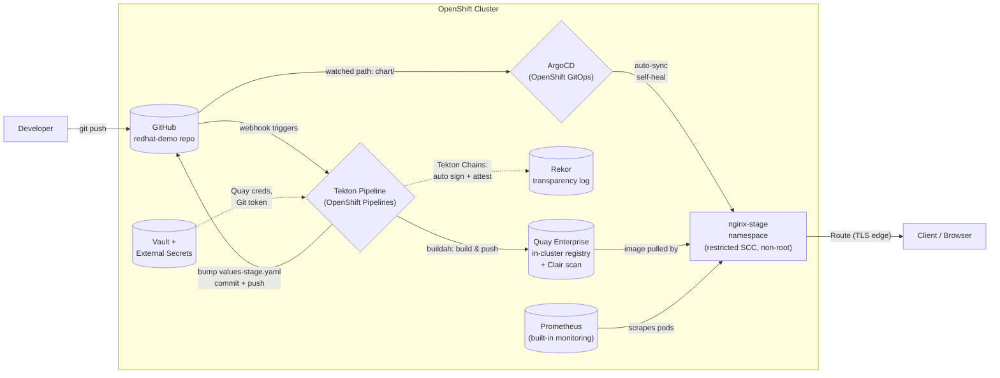

# Nginx Reference Deployment — Architecture

*OpenShift-native CI/CD & GitOps · Client demo*

**Source:** GitHub (client's existing tool, unchanged) · **CI:** Tekton (OpenShift Pipelines) · **Signing:** Tekton Chains + Rekor · **Registry:** Quay Enterprise (in-cluster) · **CD:** ArgoCD (OpenShift GitOps) · **Secrets:** Vault + External Secrets Operator · **Monitoring:** built-in Prometheus/Alertmanager

---

## Flow

## Flow, in words

1. Developer pushes to **GitHub** — the client's existing source of truth, untouched.
2. A webhook triggers a **Tekton Pipeline** running natively on OpenShift (no GitHub Actions runners, no cluster credentials leaving the platform): `git-clone` → `buildah build` → push to the **in-cluster Quay Enterprise** registry, which scans the image with **Clair** as it lands.
3. **Tekton Chains** automatically signs the image and writes an attestation to **Rekor** (the sigstore transparency log) — no manual `cosign` step, no key management on the pipeline side.
4. The pipeline bumps `chart/values-stage.yaml` with the new immutable image tag and pushes the commit back to GitHub — this is the audit trail: every deploy is a `git log` entry.
5. **ArgoCD** watches the `chart/` path and auto-syncs `nginx-stage`, self-healing any manual drift.
6. **Vault + External Secrets Operator** inject the pipeline's Quay push credentials and Git token at runtime — nothing is hardcoded in pipeline YAML or stored in GitHub secrets.
7. **Prometheus** (cluster monitoring, user-workload monitoring already enabled) scrapes pod health/resource metrics for `nginx-stage` with zero extra setup.

Everything left of "push to GitHub" is the client's world, unchanged. Everything right of it is 100% OpenShift-native — that's the pitch.

---

## Security controls baked in (production-ready posture)

| Layer | Control |
|---|---|
| Source | Branch protection on `main`; pipeline only triggers off reviewed commits |
| Build | Non-root UBI9 base image; `buildah` runs unprivileged via the pipeline `ServiceAccount` + `pipelines-scc` |
| Image | Clair vulnerability scanning in Quay on every push |
| Supply chain | Tekton Chains signs every image + generates an in-toto attestation; entries recorded in Rekor (tamper-evident transparency log) |
| Secrets | No secrets in Git or pipeline YAML — Vault-backed `ExternalSecret` resources materialize Quay/Git credentials into the namespace at deploy time |
| Runtime | `nginx-stage` enforces `restricted` SCC — containers run non-root, no privilege escalation |
| Delivery | ArgoCD `selfHeal: true` — any manual `oc apply`/console drift is automatically reverted; sync is a reviewed Git commit, not a click |
| Network | Route is TLS edge-terminated; no plaintext ingress |
| Observability | Prometheus/Alertmanager scrape pod health automatically (user workload monitoring already enabled cluster-wide) |

---

## Namespace

**`nginx-stage`** — holds both the Tekton pipeline resources and the deployed application for this demo (single-environment scope; roadmap to add `nginx-dev`/`nginx-prod` later, unchanged design).

---

## Components already verified live on this cluster

| Component | Status |
|---|---|
| OpenShift Pipelines (Tekton) 1.16.3 | Installed, Tekton Chains + Pipelines-as-Code running |
| Quay Enterprise | Running, route live, Clair scanning enabled |
| Vault + External Secrets Operator | Running, `vault-secret-store` ClusterSecretStore ready |
| OpenShift GitOps (ArgoCD) | Installed |
| Cluster monitoring | Prometheus/Alertmanager running, user workload monitoring enabled |
| `nginx-stage` namespace | **Not yet created** — next step |
