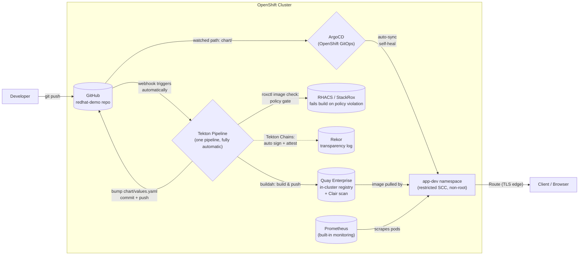

# Nginx Reference Deployment — Architecture

*OpenShift-native CI/CD & GitOps · single environment (dev) · client demo*

**Source:** GitHub (client's existing tool, unchanged) · **CI/CD:** one Tekton pipeline (OpenShift Pipelines) · **Security:** RHACS + Tekton Chains + Rekor · **Registry:** Quay Enterprise (in-cluster) · **Delivery:** ArgoCD (OpenShift GitOps) · **Monitoring:** built-in Prometheus/Alertmanager

---

## Flow

---

## The five phases

### Phase 1 — Source
The developer's world doesn't change. Code, `Dockerfile`, and the Helm chart all live in **GitHub** — the client's existing tool. A push to `main` is the only action a human ever takes.

### Phase 2 — Build & Scan (OpenShift Pipelines / Tekton)
A GitHub webhook triggers a **Tekton Pipeline** running natively on the OpenShift cluster — not an external CI runner, not GitHub Actions. It clones the source and builds the image with `buildah`. The built image is then checked with **`roxctl image check`** against **RHACS (Red Hat Advanced Cluster Security)** — already deployed and licensed on this cluster, not a third-party scanner. This evaluates the image against configured security policies (CVE severity, image composition, etc.) and **fails the build** if a policy with build-time enforcement is violated. **Tekton Chains** then automatically signs the image and records an attestation in **Rekor**, the sigstore transparency log — no manual `cosign` step, no key management.

### Phase 3 — Registry (Quay Enterprise)
The image lands in **Quay Enterprise**, running in-cluster. **Clair** scans it again on arrival as a second, independent layer. Push access is scoped to a single least-privilege robot account — the pipeline holds no broader registry credentials than it needs.

### Phase 4 — Delivery (ArgoCD / OpenShift GitOps)
The same pipeline bumps the image tag in `chart/values.yaml` and pushes that commit back to GitHub — this is the audit trail: every deployment is a `git log` entry, not a Slack message. **ArgoCD** watches that path and syncs automatically, self-healing any manual drift in the cluster.

### Phase 5 — Running (OpenShift)
The application runs under the `restricted` SCC — non-root, no privilege escalation — behind a TLS-edge Route. **Prometheus**, already scraping the cluster, shows pod health and resource usage with zero extra configuration.

---

## Red Hat / OpenShift components, explained

Everything to the right of "push to GitHub" runs on the OpenShift platform itself — this is the core of the pitch. Here's what each piece is and why it's there:

| Component | What it is | Why it's here |
|---|---|---|
| **OpenShift Pipelines** | Red Hat's supported distribution of Tekton — Kubernetes-native CI/CD. Pipelines run as pods, defined as Kubernetes objects, with no separate CI server to run or license. | Replaces the CI server. Build logic runs *on* the platform being deployed to, using the same RBAC, the same audit trail, the same cluster the app lives on. |
| **Tekton Chains** | A controller that watches pipeline runs and automatically signs any produced container image, generating a cryptographic attestation of how it was built. | Supply-chain security, automatically. No developer ever runs `cosign` by hand, and no signing keys are managed manually. |
| **Rekor** | An immutable, public transparency log (part of the sigstore project) that every signature gets recorded to. | Makes signing *provable*, not just claimed — anyone can verify an image's signature was logged at build time, not forged later. |
| **RHACS (Red Hat Advanced Cluster Security / StackRox)** | Red Hat's own security platform — image scanning, deploy-time policy enforcement (admission control), and runtime threat detection, all in one product already licensed for this cluster. | Used here as a build-time gate (`roxctl image check`) so a policy violation fails the pipeline before an image ever reaches production — not just a report generated after the fact. |
| **Quay Enterprise** | Red Hat's container registry product, running in-cluster rather than as an external SaaS. Includes its own vulnerability scanner (Clair) and fine-grained, per-repository robot-account access control. | Keeps the registry — and the credentials needed to push to it — inside the platform boundary. Least-privilege robot accounts mean the pipeline never holds more registry access than it needs. |
| **OpenShift GitOps (ArgoCD)** | Red Hat's supported distribution of ArgoCD. Continuously compares what's declared in Git against what's actually running, and reconciles the difference. | This is what makes Git the single source of truth: no `oc apply` in the deployment path at all. Manual changes to the live cluster get automatically reverted back to match Git. |
| **OpenShift cluster monitoring (Prometheus/Alertmanager)** | Built into every OpenShift cluster - not something installed separately for this demo. | Pod health, CPU, and memory are visible for any workload the moment it's deployed, with zero extra configuration. |

---

## Security controls baked in

| Layer | Control |
|---|---|
| Source | Branch protection on `main`; pipeline only triggers off reviewed commits |
| Build | Non-root UBI9 base image; `buildah` runs unprivileged via the pipeline `ServiceAccount` + `pipelines-scc` |
| Image | RHACS (`roxctl image check`) gates the build on policy violations; Clair scans again in Quay on every push - two independent layers |
| Supply chain | Tekton Chains signs every image + generates an in-toto attestation; entries recorded in Rekor (tamper-evident transparency log) |
| Runtime | `app-dev` enforces `restricted` SCC — containers run non-root, no privilege escalation |
| Delivery | ArgoCD `selfHeal: true` — any manual `oc apply`/console drift is automatically reverted |
| Network | Route is TLS edge-terminated; no plaintext ingress |
| Observability | Prometheus/Alertmanager scrape pod health automatically |

---

## Roadmap (not built now, deliberately)

Adding `stage`/`prod` later is additive: new namespaces, new `values-<env>.yaml` files, a promotion step between them (manual or gated). Not built for this demo to keep the story to one clear, fully-automatic loop.

---

## Components verified live on this cluster

| Component | Status |
|---|---|
| OpenShift Pipelines (Tekton) 1.16.3 | Installed, Tekton Chains + Pipelines-as-Code running |
| Quay Enterprise | Running, route live, Clair scanning enabled |
| RHACS (StackRox) | Running (Central, Scanner, Collectors, Admission Control), gating builds via `roxctl image check` |
| OpenShift GitOps (ArgoCD) | Installed, `nginx-app-dev` Application syncing |
| Cluster monitoring | Prometheus/Alertmanager running, user workload monitoring enabled |
